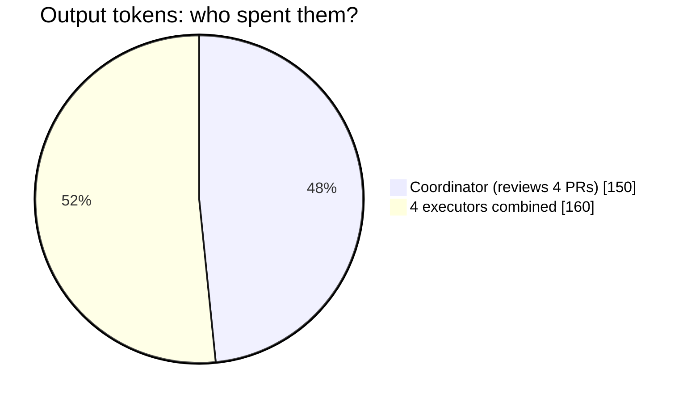
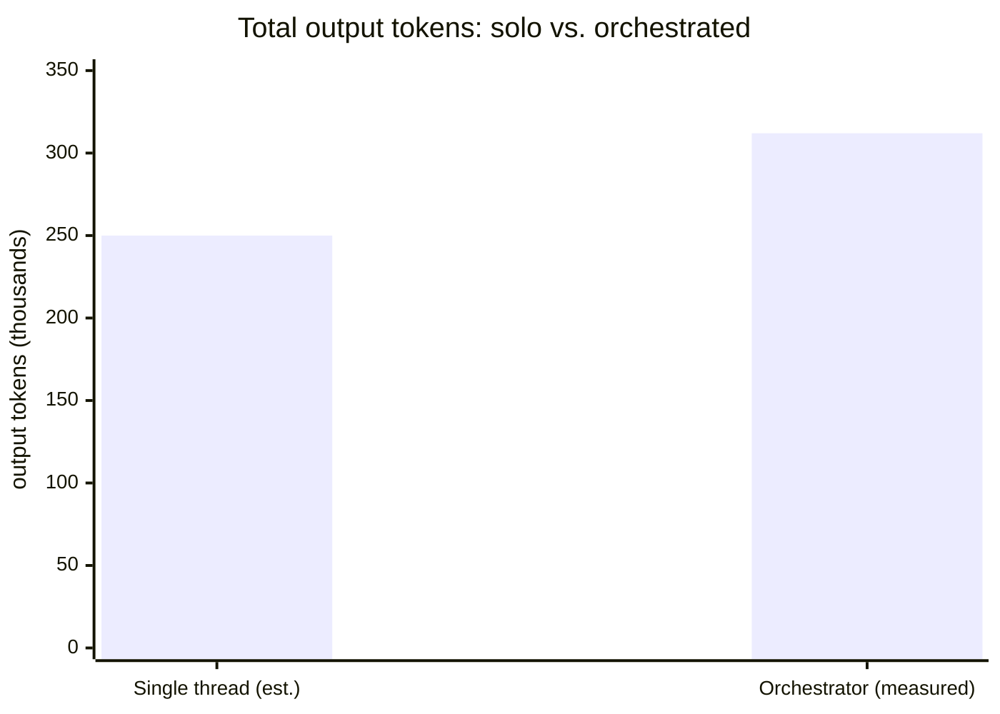
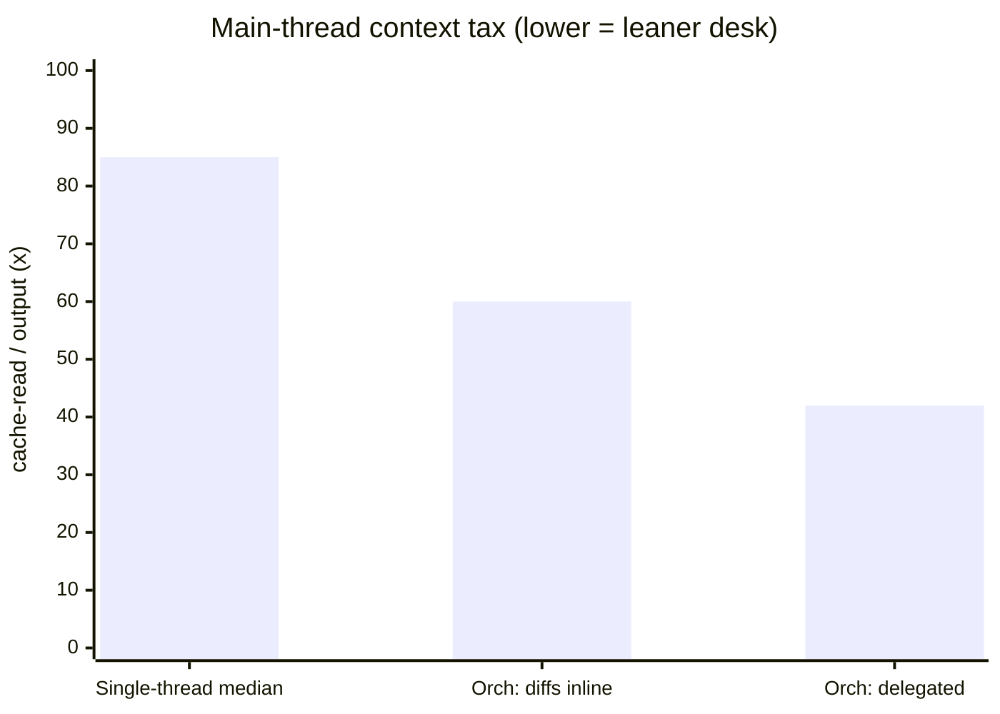

# fable-sonnet-orchestrator-kit

A drop-in **Claude Code** operating model: your main agent becomes an **orchestrator** that turns
intent into GitHub issues and fans work out to model-pinned **executor subagents** — one issue,
one git worktree, one PR into `main`. A **code-based PowerShell Stop hook** (not a model's
memory) enforces every hand-off, so the loop cannot silently break.

Two human gates bracket the autonomous work: a **plan gate** before any issue is created (you
approve the issue list, model tiers, and dispatch waves), and a per-PR **merge gate** where you
confirm each passing PR before the orchestrator merges. Everything between — dispatch, executor
work, the review loop — runs without interruption.

## In plain words (explain-like-I'm-10)

Imagine you're the **lead of a small building crew** putting up a treehouse. Instead of sawing
every board yourself, you run the job like this:

- ✏️ **Write each job on its own card.** Every piece of work becomes a GitHub *issue* before anyone
  picks up a tool — one tidy to-do list the whole crew can see.
- 👷 **Give each card to a different worker, in their own corner.** Each *executor* takes one issue
  and builds in its own private copy of the project (a git *worktree*), so nobody saws into anyone
  else's board. Several build at the same time.
- 📋 **Every finished piece comes back for a check.** A worker never nails anything to the treehouse
  themselves — they hold their piece up for you to inspect (a *pull request*). You read the whole
  thing and either say "looks good" or hand it back with notes.
- 🤖 **A rule-checking robot keeps everyone honest.** A little PowerShell program (the *Stop hook*)
  sits at the door. A worker literally *cannot* wander off until they've opened their pull request
  and fixed every note you left. It's code, not a promise, so the routine can't quietly fall apart.
- ✅ **You make the final call.** Nothing is nailed in for real until you — the human — say "yes,
  ship it" (*merge*).

**Why bother running it this way?**

- **Pieces get built in parallel** → less waiting.
- **Your own desk stays clean** → you only ever look at *finished* pieces, never the pile of sawdust
  each worker makes. (This turns out to be the biggest win — see the numbers below.)
- **Every change is small and already checked** → mistakes are easy to spot, and easy to undo one at
  a time.

The catch: **being the lead isn't free.** Coordinating a crew costs *something* extra versus just
building it yourself. So we measured exactly how much — that's the [cost section](#what-it-costs-and-when-its-worth-it-measured) below.

## Prerequisites

- [Claude Code](https://docs.claude.com/en/docs/claude-code) (2.1.x verified; earlier versions
  may work)
- [`gh` CLI](https://cli.github.com/) authenticated **non-interactively** (credential store — no
  interactive prompts)
- **PowerShell 7+** (`pwsh`) on your `PATH`, for the Stop hook

## Install

Drop the `.claude/` folder from this repo into your project root (merge with any existing
`.claude/`). Then search-and-replace three placeholders in the skill and executor files:

| Placeholder | Replace with |
|---|---|
| `<YOUR_ORG>` | GitHub owner / org |
| `<REPO_ROOT>` | Local checkout root, **forward slashes** |
| `<ENV_VALUES_DIR>` | An out-of-repo directory for secrets |

Tune the label list and conflict-file list in `.claude/skills/fable-orchestrator/SKILL.md` to
your codebase (conflict-prone files, one DB migration in flight at a time, etc.).

> **Evolving to a user-scope install with a per-repo toggle?** `ORCHESTRATOR-MODE-SKETCH.md`
> documents the finalized design for installing the agents, skills, and hook at `~/.claude/`
> (one copy serves many repos) and toggling orchestrator mode per-repo with
> `/orch on` | `/orch off` | `/orch status`. It is ready to implement from that document alone.

## Use

Open Claude Code in your project. The `SessionStart` hook auto-injects the `fable-orchestrator`
skill every session, so the main agent always boots into its orchestrator role — no manual prompt
needed.

When you describe a task, the session runs as follows:

1. **Plan gate** — the orchestrator restates your request, decomposes it into a list of GitHub
   issues (each with a title, one-line objective, model tier, and dependencies), and presents the
   full plan for your approval **before creating anything on GitHub**. Model tiers are visible and
   overridable here.
2. **Fan-out** — on approval, the orchestrator dispatches one executor subagent per `ready` issue:
   `sonnet-executor` (default, `tier:sonnet`), `opus-executor` (`tier:opus`), or `haiku-executor`
   (`tier:haiku`). Independent issues run in parallel (up to 3-4 concurrent); conflict-prone
   issues serialize.
3. **Review loop** — each executor opens a PR whose body is a review manifest (per-criterion
   evidence). The orchestrator dispatches a read-only `pr-reviewer` subagent for the first pass —
   full diff, manifest claims checked against real evidence, targeted-test re-run when in doubt —
   then reads its structured verdict, spot-reads any flagged hunks, and retains sole review
   authority. Change requests are batched into **one consolidated review round per fix cycle**
   (the full verdict plus every spot-read finding, never trickled) and fed back to the executor
   through the Stop gate automatically — the executor cannot end its turn until it addresses
   every point. Approved PRs come to you as a ready-to-merge report.
4. **Merge gate** — the orchestrator presents each passing PR and waits for your confirmation. On
   your word, it merges, confirms the issue auto-closed, removes the executor's worktree, and
   prunes.

## How it works

**Issue → worktree → PR → review → human merge.** Every unit of work is a GitHub issue before any
code is written. The orchestrator dispatches one executor subagent per ready issue; the executor
creates a git worktree off `main`, makes the smallest correct change with bespoke targeted tests,
and opens one PR into `main` whose body is a review manifest (`Closes #N` plus per-criterion
evidence). The orchestrator dispatches a read-only `pr-reviewer` subagent for the first pass, reads
its structured verdict, and spot-reads any flagged hunks while retaining sole review authority. If
changes are needed, it posts ONE consolidated `[ORCH-REVIEW] CHANGES-REQUESTED` comment per fix
cycle — the full verdict plus every spot-read finding, never a follow-up trickle against the same
unaddressed commit — iterating until the PR is clean, then surfaces a ready-to-merge report to you.

**Code-based Stop gate.** `executor-stop-gate.ps1` fires at every executor turn-end via a
`SubagentStop` hook. It gates three cases:

- No PR opened and no `BLOCKED:` declaration → block once, telling the executor to open the PR
- Changes requested (a PR comment starting `[ORCH-REVIEW] CHANGES-REQUESTED`, or a formal
  request-changes review from a different GitHub account) with no fix commit since → block and
  inject the full review so the executor addresses it now
- Merged, closed, approved, or awaiting review → allow; the harness task-notification tells the
  orchestrator the executor finished

The gate is **fail-open**: any parse, network, or `gh` failure allows the stop — tooling breakage
never traps an agent.

**Orchestrator vs. executor asymmetry.** The orchestrator is the main agent itself — it needs no
agent definition. The `fable-orchestrator` skill is auto-injected every session by the
`SessionStart` hook, which is what boots the main agent into its orchestrator role. The executors
(`sonnet-executor`, `opus-executor`, `haiku-executor`, `issue-triage`) are subagents spawned via
the Agent tool, so each needs an agent definition (pinning model, effort, and tools) paired with
a matching skill; the executor Stop gate is wired in `.claude/settings.json` as a `SubagentStop`
hook. Main-agent role → skill only; spawned subagent → agent definition **plus** skill.

## Continuous integration

This kit has its own CI: [`.github/workflows/gate-tests.yml`](.github/workflows/gate-tests.yml)
runs `tests/gate.Tests.ps1` under Pester ≥5 on `windows-latest` (`pwsh`) whenever a pull request
touches the Stop gate script, `.claude/settings.json`, anything under `tests/`, or the workflow
file itself — plus a manual `workflow_dispatch` trigger. The job installs Pester ≥5 if the runner
doesn't already have it, then asserts the Pester result's `FailedCount` is zero and fails the job
otherwise, so a red gate test cannot merge silently. This is CI **for the kit's own test suite**;
it is not part of what the Install section above drops into a consuming project.

## What it costs, and when it's worth it (measured)

Running a crew has overhead. To find out how much, we instrumented **one real sprint** end-to-end —
four issues, four executors (two `sonnet`, two `opus`) doing moderate doc/test work — and counted
every token. (Method and the opt-in capture trick are in
[`docs/OBSERVABILITY.md`](docs/OBSERVABILITY.md); executor transcripts are otherwise thrown away the
moment a subagent stops, which is exactly why this is normally invisible.)

Here is what that sprint cost, and the three things it taught us.

### 1. The coordinator is *not* the cheap part

You'd guess the "lead" is a light job — hand out cards, collect finished work. Wrong. Reviewing four
pull requests — reading every diff, checking each claim, running spot-checks — is real generation
work. The coordinator spent **as much as all four workers combined**:

**What this means:** output split almost 50/50 between the *single* coordinator and the *four*
executors — so the coordinator alone did roughly what one executor did, times four. The "cheap
little coordinator" mental model is wrong whenever review is thorough. (That other ~160k half is
four executors at ~40k output each.)

### 2. The premium is modest — about 1.25×, not 2×

The whole sprint cost **~312k output tokens** (and ~25M cache-read). Against an *estimated* baseline
of doing the same four tasks in a single thread, that is a premium of roughly **1.25×** — noticeably
less than the 1.5–2× we'd feared before actually measuring:

**What this means:** you pay about a **25% token surcharge** to run the crew. That buys parallel
work, isolated contexts, and four small reviewable PRs instead of one giant diff — not the budget
blow-up the earlier guess implied.

### 3. What the surcharge buys: a much leaner main thread

The extra 25% buys something concrete. *Context tax* = cache-read tokens ÷ output tokens — basically
**how cluttered a thread's desk gets** as it works. A normal single-thread session runs about **85×**
(median across 33 real sessions). The orchestrator's *own* thread runs far lower, because every
worker's file reads, edits, and test output pile up on *their* disposable desk, not the lead's:

**What this means:** the coordinator's desk stays **30–50% cleaner** than a single thread doing the
same work — *but only if it delegates review* (42×). Pull every diff into the main thread to read it
yourself and you spend that advantage back down toward the median (60×). The lean main thread is the
real payoff, and it is conditional on actually delegating.

### The exact numbers

| | Output | Cache-read | Context tax |
|---|---|---|---|
| **Full 4-issue sprint** | ~312k | ~25M | 80× |
| Coordinator (review) | ~150k (49%) | ~9M (37%) | 42–60× |
| 4 executors combined | ~160k (51%) | ~16M (63%) | 72–204× each |
| — per executor (2× `sonnet`, 2× `opus`) | ~40k | ~4M | — |
| **vs. single thread (estimated)** | **~1.25×** | — | median 85× |

**Caveats, so you can weigh the numbers honestly:** the single-thread baseline is *estimated, not
measured*; this was **one** sprint (`n=1`); and the tasks were moderate doc/test work — heavier
coding would shift more of the cost onto the executors and less onto review.

### So: when is it worth it?

- **Reach for orchestrator mode when** work is parallelizable — several independent, `ready` issues —
  and doing it in one thread would balloon that thread's context past a comfortable session. You pay
  ~25% more tokens to keep your main thread lean and get small, individually reviewable PRs.
- **Stay single-thread when** the task is focused and sequential — one file, one clear fix, a quick
  question. Filing an issue, spinning a worktree, and reviewing a PR is pure overhead when there's no
  parallel work to pay for it.

## Works with memhub

[memhub](https://github.com/kninetimmy/memhub) is a SQLite-backed rolling-memory system for
Claude Code. This operating model uses memhub as its single source of rolling project memory —
there is no separate rolling-memory file.

The orchestrator runs **`/wrap-up` at milestones** (merges, architecture decisions,
newly-learned gotchas); memhub's own approval gates stay intact. Executors **never write** to
`agent_docs/`, `PROJECT.md`, or `PROJECT_LEDGER.md` — those are orchestrator/memhub-owned
(K9 rule: subagent writes there are forbidden).

At session start, read `PROJECT.md` if the repo has one — that is the canonical project state.

## Compatibility notes (Claude Code 2.1.x, Windows — verified empirically)

- Hook command strings execute through **Git Bash**, even on Windows. Use bash-expanded
  `$CLAUDE_PROJECT_DIR` in `settings.json` hook commands — pwsh-style `$env:VAR` gets mangled
  (bash expands `$env` to empty) before PowerShell ever runs.
- `hooks:` declared in agent **frontmatter never fire**. The executor Stop gate is therefore
  registered in `.claude/settings.json` under `SubagentStop` with
  `"matcher": "sonnet-executor|opus-executor|haiku-executor"`, so no other subagent is gated.
- A `SubagentStop` hook **blocks by printing `{"decision":"block","reason":"..."}` to stdout**
  (exit 0). Exit code 2 + stderr — the classic Stop-hook contract — is treated as a non-blocking
  error and the subagent stops anyway. The gate also reads the executor's transcript from
  `agent_transcript_path`; `transcript_path` in SubagentStop input is the *parent* session's.

## IMPORTANT — model config (the #1 cost gotcha)

Executors are pinned in their agent definition files:

| Agent | `model:` pin | When dispatched |
|---|---|---|
| `sonnet-executor` | `claude-sonnet-5` | Default — all `tier:sonnet` issues |
| `opus-executor` | `claude-opus-4-8` | `tier:opus` only — ambiguous debugging, architecture-adjacent work |
| `haiku-executor` | `claude-haiku-4-5-20251001` | `tier:haiku` only — mechanically-determined work, zero design latitude |
| `issue-triage` | `claude-sonnet-5` | GitHub-issue bookkeeping clerk |

All executors run at `effort: max`. The exact version IDs **enforce** the right model on each
dispatch. But some Claude Code setups make subagents **inherit the session model** instead of
honoring the agent's `model:` frontmatter. So:

- Keep your **main session on a strong model** (e.g. Opus 4.8) for orchestration judgment.
- **Verify dispatched executors run on their pinned model**, not the expensive main-session model.
  If they inherit the session model, pass the model explicitly on each dispatch.
- `tier:opus` dispatches are Opus-rate calls — the plan gate is where you keep an eye on that.
- To update a pin later, edit the `model:` line in the relevant `.claude/agents/*.md` file — the
  pin is deliberate, so change it deliberately.

## Troubleshooting / FAQ

- **`gh` isn't authenticated — can an executor "get away with" stopping without a real PR?** The
  stop gate is **fail-open by design**: any parse, network, or `gh` failure inside it results in
  `exit 0` (allow the stop) rather than trapping the executor. Its first check — "you must produce
  a PR URL or declare `BLOCKED:`" — only scans the executor's own transcript text and needs no
  `gh` call, so it still applies no matter what. But once a PR URL is present, the gate calls
  `gh pr view` to check merged/closed state and any `[ORCH-REVIEW] CHANGES-REQUESTED` feedback; if
  `gh` can't authenticate, that call fails, the `catch` block exits `0`, and the gate allows the
  stop **without having verified review state**. Confirm `gh` is authenticated
  non-interactively with `gh auth status` before relying on the review loop.

- **The `SubagentStop` hook doesn't seem to fire.** Two preconditions, both required:
  1. The hook's `matcher` in `.claude/settings.json` is the exact regex
     `"sonnet-executor|opus-executor|haiku-executor"` — it only fires for subagent types matching
     that pattern. A renamed or additional executor agent needs the matcher updated too, or its
     stops go ungated.
  2. The hook command shells out to `pwsh` directly
     (`pwsh -NoProfile -ExecutionPolicy Bypass -Command "..."`), so **PowerShell 7+ must be on
     `PATH`**. Confirm with `pwsh -v` (or `Get-Command pwsh`).

- **Windows path gotchas.** Hook command strings in `settings.json` execute through **Git Bash**
  even on Windows, so use bash-expanded `$CLAUDE_PROJECT_DIR` — Git Bash resolves it to the real
  path before `pwsh` ever runs. PowerShell's `$env:CLAUDE_PROJECT_DIR` syntax does not work here;
  bash mangles `$env` to empty first. Both hooks invoke
  `pwsh -NoProfile -ExecutionPolicy Bypass -Command "..."`, which runs without loading your
  PowerShell profile and without inheriting your machine's script execution-policy restrictions —
  if you run the same `.ps1` file directly from an ordinary PowerShell window, pass the same flags
  or you may hit a different execution policy. See "Compatibility notes" above for more detail.

- **Is orchestrator mode on right now?** Depends which install you're running:
  - **This repo's drop-in `.claude/`** (the Install section above) has no toggle — the
    `SessionStart` hook in `.claude/settings.json` unconditionally emits the `fable-orchestrator`
    skill every session, so the main agent always boots into its orchestrator role once `.claude/`
    is installed.
  - **The evolving user-scope install** (`ORCHESTRATOR-MODE-SKETCH.md`, `/orch on` | `/orch off` |
    `/orch status`) makes it per-repo instead: orchestrator mode is on for a given repo exactly
    when a gitignored, empty flag file `.claude/orch.on` exists in that checkout. Check directly
    (`Test-Path .claude/orch.on` in PowerShell) or ask the toggle: `/orch status`.

## Security

These files contain **no secrets, tokens, or credentials** — only references to *where* secrets
should live (your out-of-repo `<ENV_VALUES_DIR>`). Keep real secrets outside any repo.
